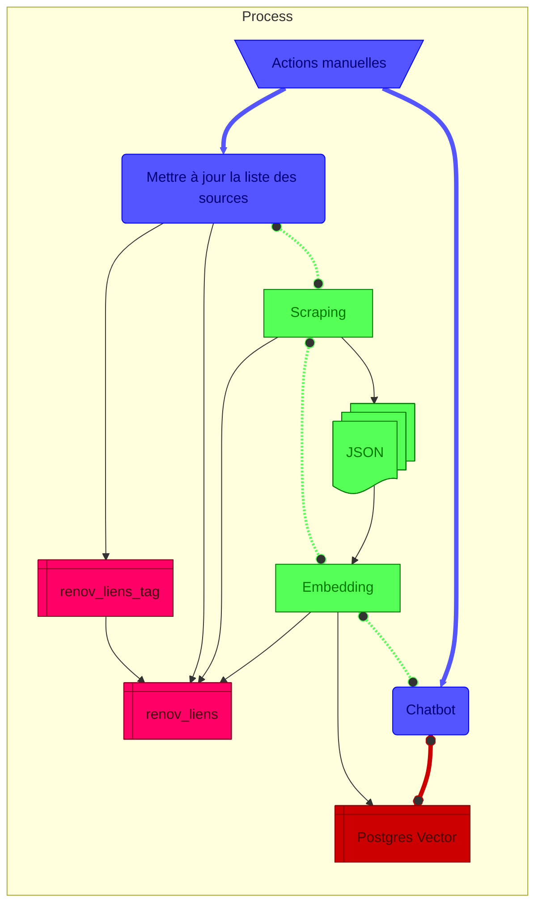

# Organisation

```mermaid
flowchart LR
    subgraph sub_process[Process]
        renov_liens_tag@{ shape: win-pane }
        renov_liens_tag --> renov_liens@{ shape: win-pane }
        scrap_json@{ shape: docs, label: "JSON" }
        AM@{ shape: trap-t, label: "Actions manuelles" }
        AM:::manual
        
        renov_liens:::bdd
        renov_liens_tag:::bdd

        a(Mettre à jour la liste des sources):::manual
        a o-.-o b[Scraping]:::inner
        b o-.-o c[Embedding]:::inner
        c o-.-o d(Chatbot):::manual

        AM ==> a
        AM ==> d

        a --> renov_liens
        a --> renov_liens_tag
        b --> renov_liens
        b --> scrap_json:::inner
        c --> renov_liens
        scrap_json --> c
        c --> PV@{ shape: win-pane, label: "Postgres Vector" }
        d o--o PV:::pgv

        linkStyle 1  stroke-width:3,fill:none,stroke:#5f5
        linkStyle 2  stroke-width:3,fill:none,stroke:#5f5
        linkStyle 3  stroke-width:3,fill:none,stroke:#5f5
        linkStyle 4  stroke-width:5,fill:none,stroke:#55f
        linkStyle 5  stroke-width:5,fill:none,stroke:#55f
        linkStyle 13 stroke-width:5,fill:none,stroke:#c00
    end

    classDef manual fill:#55f,stroke:#00f,color:#007,stroke-width:1px;
    classDef inner  fill:#5f5,stroke:#070,color:#070,stroke-width:1px;
    classDef bdd    fill:#f06,stroke:#802,color:#401,stroke-width:1px;
    classDef pgv    fill:#c00,stroke:#800,color:#400,stroke-width:1px;
```
